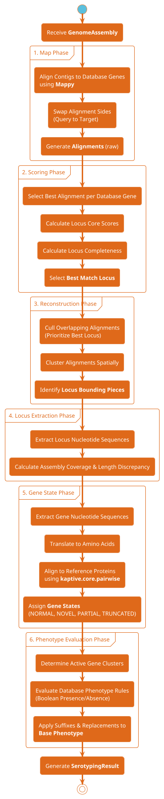

# Serotyping with Kaptive

## Serotyping Overview

The `Serotyper.__call__` method executes a highly-optimized, multi-phase pipeline to analyze a genome assembly and produce a serotyping result. 
The following sequence diagram details these phases:

## Locus Scoring Algorithm

This provides a detailed overview of the mathematical scoring algorithm that Kaptive uses to determine the best-matching locus for a given genome assembly. The algorithm is designed to be highly sensitive to the specific genes that uniquely define a locus, while appropriately managing highly conserved "core" genes that are shared across many different loci.

### 1. Initial Gene Mapping and Scoring
When Kaptive analyses a genome, it first attempts to find matches for every gene present in its reference database. When a match is found, a **Raw Gene Score** ($S_{gene}$) is calculated. This score measures the quality of the alignment by combining sequence identity and coverage:

$$S_{gene} = \text{Identity} \times \frac{\text{Alignment Length}}{\text{Expected Gene Length}}$$

*Where:*
* **Identity:** The fraction of matching nucleotides between the genome sequence and the database gene.
* **Alignment Length:** The length of the matching region.
* **Expected Gene Length:** The full length of the gene as defined in the database.

This ensures that partial fragments or highly divergent genes receive lower scores compared to full-length, identical matches.

### 2. Gene Weighting (IDF)
In many bacterial species (like *Klebsiella pneumoniae* or *Acinetobacter baumannii*), the capsular synthesis regions share highly conserved "core" genes (e.g., *galF*, *cpsACP*, or *gpi*). Because these genes are almost universally present regardless of the specific serotype, relying on them equally would artificially inflate the scores of incorrect loci.

To solve this, Kaptive applies an **Inverse Document Frequency (IDF)** weight to every gene. Rare genes (which are highly specific to a single or a few loci) are given much higher mathematical importance than common core genes.

$$W_{gene} = \log_2\left(\frac{N_{loci}}{N_{loci\_containing\_gene}}\right) + 1.0$$

*Where:*
* $N_{loci}$ is the total number of distinct loci in the database.
* $N_{loci\_containing\_gene}$ is the number of loci that contain this specific gene or a highly homologous variant of it.
* The $+ 1.0$ ensures that even the most universally conserved core genes still contribute a baseline value to the score.

The final **Weighted Gene Score** is simply:

$$\text{Weighted Score}_{gene} = S_{gene} \times W_{gene}$$

### 3. Accumulating Locus Scores
Once all genes are mapped and weighted, Kaptive evaluates every possible locus in the database independently to see how well it is represented in the genome.

First, Kaptive calculates a **Core Score** ($S_{core}$) for each locus by summing the weighted scores of all the *expected* genes for that specific locus. (Note: genes designated as optional or "extra" in the database are excluded from this core summation).

$$S_{core} = \sum_{gene \in \text{expected}} \text{Weighted Score}_{gene}$$

### 4. Locus Completeness Penalty
A high Core Score alone is not enough to declare a match. A locus might accumulate a high score if a genome happens to contain many of its genes, but if the genome is missing key expected genes for that locus, it is likely the wrong match.

To penalize loci with missing genes, Kaptive calculates a **Completeness** factor ($C$). Completeness represents the proportion of expected genes that were successfully found in the genome.

$$C = \frac{\text{Count}_{found}}{\text{Count}_{expected}}$$

### 5. Final Total Score and Selection
The final score used to rank and select the best locus is the product of the Core Score and the Completeness factor. 

$$\text{Score}_{total} = S_{core} \times C$$

By multiplying the Core Score by the Completeness, Kaptive heavily penalizes loci that are missing expected genes. For example, if a locus has a fantastic Core Score because it shares many genes with the genome, but it is only 50% complete (missing half its defining genes), its final score will be halved.

#### Summary of Selection
After calculating $\text{Score}_{total}$ for every possible locus in the database, Kaptive ranks them in descending order. The locus with the highest $\text{Score}_{total}$ is chosen as the **Best match locus**. Following this algorithmic selection, a secondary "Phenotype Evaluation" phase may be triggered (e.g., checking specific *wzc* alleles) to refine the final serotype prediction.

## Phenotype Evaluation Logic

While predicting the "best match locus" is heavily reliant on quantitative metrics (Core Score and Completeness), the final biological prediction of what the genome actually *does* or *looks like* requires qualitative logic. We refer to this as the **Phenotype Evaluation Phase**.

In bacterial serotyping, two genomes may share the exact same underlying locus backbone (e.g., KL1), but specific mutations, gene disruptions, or mobile genetic element insertions can alter the final expressed serotype or phenotype (e.g., adding an acetyl group, or turning off capsule production entirely).

Kaptive uses a highly-optimized Boolean rule engine to apply these nuanced biological rules.

### 1. Determining Gene States
Before any phenotype rules can be evaluated, Kaptive must assess the "health" of every gene found in the locus. 

Each gene is translated into its corresponding amino acid sequence and aligned to the database reference. Based on this alignment, it is assigned a **Gene State**:
* **NORMAL**: The gene is fully intact and its sequence identity exceeds the database's minimum identity threshold.
* **PARTIAL**: The gene was cut off by the edge of a fragmented assembly contig. Because we cannot know if the missing portion is intact, we assume it is functional for the sake of caution.
* **TRUNCATED**: The gene contains a premature stop codon, frameshift, or massive internal deletion, indicating it is definitively broken.
* **NOVEL**: The gene is fully present, but its sequence identity falls below the database threshold, suggesting it may be a novel variant with potentially different function.

### 2. Defining "Active" Gene Clusters
In Kaptive's logic, a gene cluster (a group of homologous genes) is considered **Active** in the genome only if a corresponding gene is found in a `NORMAL` or `PARTIAL` state.

$$\text{Active}(g) = \begin{cases} \text{True} & \text{if state}(g) \in \{\text{NORMAL}, \text{PARTIAL}\} \\ \text{False} & \text{if state}(g) \in \{\text{TRUNCATED}, \text{NOVEL}, \text{MISSING}\} \end{cases}$$

### 3. The Boolean Rule Engine
Phenotype rules are defined in the database. Each rule contains three critical conditions that must be met simultaneously for the rule to trigger.

1. **Locus Match**: The rule must be explicitly valid for the currently predicted Best Match Locus.
2. **Presence Conditions**: A specific set of gene clusters must be *Active*.
3. **Absence Conditions**: A specific set of gene clusters must be *Inactive* (missing, broken, or novel).

Mathematically, a rule is valid if and only if:

$$\text{Valid}(R) = (\text{Locus} \in R_{loci}) \wedge \left( \forall g \in R_{required}, \text{Active}(g) \right) \wedge \left( \forall g \in R_{absent}, \neg\text{Active}(g) \right)$$

*By using highly-optimized bitwise operations on boolean masks, Kaptive evaluates these rules across thousands of genomes almost instantaneously.*

### 4. Applying the Rules
Every locus has a default "Base Phenotype" (for example, the locus `KL104` might have a default phenotype of `K104`). 

When one or more phenotype rules evaluate to True, they modify the Base Phenotype in two distinct ways depending on the type of the rule:

#### A. Replacement Rules
Replacement rules indicate a fundamental shift in the serotype. If a replacement rule is triggered, the Base Phenotype is completely overwritten by the new phenotype string.
* *Example:* If the genome is `KL30`, but a critical *wzy* gene is mutated/inactive, a rule might completely replace the phenotype with `Untypeable` or `K30-mutant`.
* *Conflict Resolution:* If multiple replacement rules trigger simultaneously, the rule with the highest predefined **Priority** wins.

#### B. Suffix Rules
Suffix rules indicate an additive change or a minor modification. They are appended to the end of the Base Phenotype.
* *Example:* If a mobile element inserts an extra acetyltransferase gene, a suffix rule might append `+Ac` to the phenotype, resulting in `K104+Ac`.
* *Conflict Resolution:* If multiple suffix rules trigger, they are all appended to the phenotype string in descending order of their **Priority**.

#### Final Output
Once all valid replacements and suffixes are processed, the final string is returned as the predicted **Phenotype** of the genome assembly.
