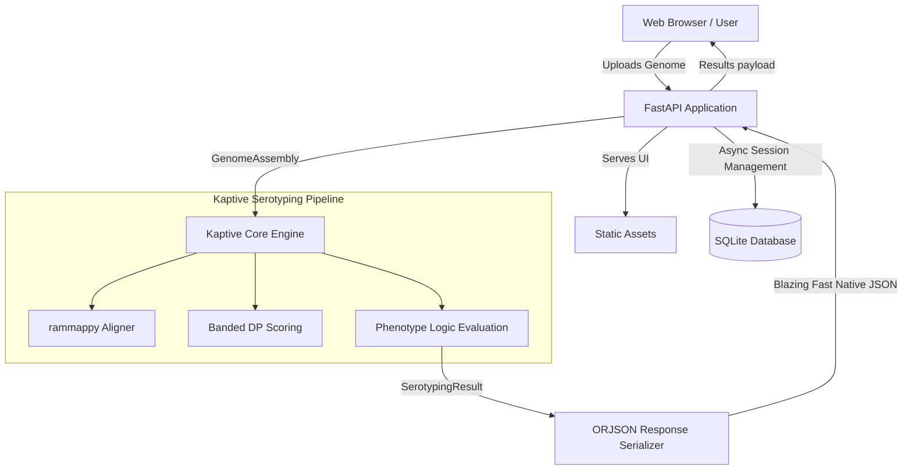

## 📖 Background

Historically, running Kaptive required command-line expertise. **Kaptive-Web** was created to democratize access to this powerful tool, providing researchers of all computational skill levels an intuitive web portal to upload assemblies, run the serotyper, and interactively explore the results.

## 🏗️ v2 Design

Kaptive-Web v2 has been completely rewritten from the ground up to be faster, more robust, and easier to deploy. 

The backend is built in modern Python (3.11+) using **FastAPI**. It leverages asynchronous I/O and direct integration with the Kaptive core API. To handle the massive, complex dataclasses and NumPy arrays generated by Kaptive's internal engine, the API utilizes a custom **ORJSON** response class, binding directly to C-hooks for blistering fast serialization.

### Backend Architecture

### Frontend Implementation

The frontend is a lightweight, responsive interface bundled directly with the application. It consists of static HTML, CSS, and Vanilla JavaScript assets (located in `src/kaptive_web/frontend/`) that are served via FastAPI's `StaticFiles` integration. 

It handles:
- File chunking and progress reporting
- Rendering rich JSON responses from the backend
- Interactive components, tables, and badges for exploring locus matches
