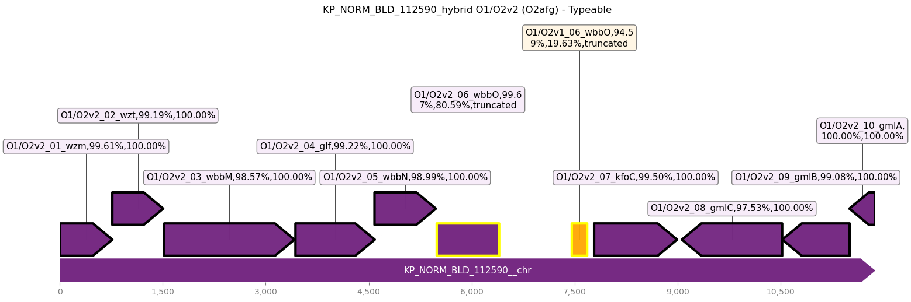

**************************************
Outputs
**************************************

.. _Tabular:

Tabular
==============

The main output of the assembly typing mode is a tab-delimited table of the results with the following columns:

======================================   =====================================================================================================================================
Column name                              Description
======================================   =====================================================================================================================================
Assembly                                 The name of the input assembly, taken from the assembly filename.
Best match locus                         The locus type which most closely matches the assembly.
Best match type                          The predicted serotype/phenotype of the assembly.
Match confidence                         A categorical measure of locus call quality (see confidence score).
Problems                                 Characters indicating issues with the locus match (see problems).
Identity                                 Weighted percent identity of the best matching locus to the assembly.
Coverage                                 Weighted percent coverage of the best matching locus in the assembly.
Length discrepancy                       If the locus was found in a single piece, this is the difference between the locus length and the assembly length.
Expected genes in locus                  A fraction indicating how many of the genes in the best matching locus were found in the locus part of the assembly.
Expected genes in locus, details         Gene names for the expected genes found in the locus part of the assembly.
Missing expected genes                   A string listing the gene names of expected genes that were not found.
Other genes in locus                     The number of unexpected genes (genes from loci other than the best match) which were found in the locus part of the assembly.
Other genes in locus, details            Gene names for the other genes found in the locus part of the assembly.
Expected genes outside locus             A fraction indicating how many of the expected genes which were found in the assembly but not in the locus part of the assembly (usually zero)
Expected genes outside locus, details    Gene names for the expected genes found outside the locus part of the assembly.
Other genes outside locus                The number of unexpected genes (genes from loci other than the best match) which were found outside the locus part of the assembly.
Other genes outside locus, details       Gene names for the other genes found outside the locus part of the assembly.
Truncated genes, details                 Gene names for the truncated genes found in the assembly.
Extra genes, details                     Gene names for the extra genes found in the assembly.
======================================   =====================================================================================================================================

.. note::
 Numbers beside gene names indicate the percent identity and percent coverage of the gene in the assembly.

.. note::
 You may sometimes see two copies of the same gene in the ``Expected genes in locus, details`` column.
 These represent (likely) parts of the same gene which have usually been split over contigs.
 In Kaptive v3.0.0 onwards, we adopted this behaviour to allow users to see where locus splitting as occurred,
 and determine the total percent identity of a gene that has been split.

The default is to print this table to **stdout**.
You can use UNIX redirection operators (``>`` or ``>>``) or the ``-o``/``--out`` flag to write to a file.

If the summary table already exists and is not empty, Kaptive will append to it (not overwrite it) and suppress the header line.
This allows you to run Kaptive in succession on sets of assemblies, all outputting to the same table file.

To disable the tabular output, simply redirect the output to ``/dev/null``.

.. _Fasta:

Fasta
==============
The ``-f/--fasta`` flag produces a fasta file of the region(s) of the assembly which correspond to the best
locus match. This may be a single piece (in cases of a good assembly and a strong match) or it may be in multiple
pieces (in cases of poor assembly and/or a novel locus).

You can specify either a directory, which will write one file per assembly named as ``{assembly}_kaptive_results.fna``,
**or** a single file ("-" for ``stdout``), which will write all the sequences to that file.

For example::

        kaptive assembly kpsc_k assembly.fasta -f

This result in default behaviour which will produce one file per assembly in the current directory. However,
to specify a directory::

        kaptive assembly kpsc_k assembly.fasta -f kaptive_results/

or for a single file, both are valid::

        kaptive assembly kpsc_k assembly.fasta -f kaptive_results.fna
        kaptive assembly kpsc_k assembly.fasta -f - > kaptive_results.fna

.. note::
 This is the same as the ``--fna`` flag in ``kaptive convert``.

.. _JSON:

JSON
==============
The ``-j/--json`` flag produces a JSON file of the results which allows Kaptive to reconstruct
the ``TypingResult`` objects after a run which can be used with :ref:`kaptive-convert`.
Unlike previous version (2 and below), this is a JSON lines file (or "-" for ``stdout``), where each line is a JSON object
representing the results for a single assembly. If the file already exists, Kaptive will append to it (not overwrite it).

The default is to write this file to: ``kaptive_results.json``, however the path can be specified after the flag,
for example::

        kaptive assembly kpsc_k assembly.fasta -j kaptive_results.json

.. warning::
 It is possible to write **all** text formats (TSV, JSON and FASTA) to the same file (including stdout), however
 this is not recommended for downstream analysis.

.. _Plot:

Plot
==============
Kaptive can now produce a visual representation of the locus match in the assembly. This is done using the
``-p/--plot`` flag, which produces a plot in the format specified by the ``--plot-fmt`` flag (default: png).

The default is to write files to the current directory with the name: ``{assembly}_kaptive_results.{fmt}``,
however the output directory can be specified after the flag, for example::

        kaptive assembly kpsc_k assembly.fasta -p kaptive_plots

The plot is a visual representation of the locus genes and the corresponding assembly contig pieces.

* The gene transparencies are based on the protein percent identity.
* The contig transparencies are based on the final percent identity.
* Unexpected genes are shown in orange.
* Genes are blunt and outlined in yellow if they are truncated.
* Genes are outlined in red if they are below the gene identity threshold.
